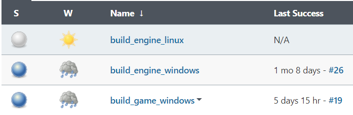

# Build Unreal Engine & games with Jenkins on GKE

This repo brings up a Kubernetes cluster in Google Kubernetes Engine. It installs Jenkins. It runs build jobs on worker nodes in the cluster. The worker nodes are created/destroyed on-demand.

# Status

Linux doesn't build Unreal Engine yet due to [Unreal's setup script failing if UE is imported as a submodule](https://github.com/falldamagestudio/UE-Jenkins-BuildSystem/issues/25).

Windows build both Engine and an example game. [The cold boot times for build jobs are sub-par (it takes ~20 minutes to create a VM and pull the required images)](https://github.com/falldamagestudio/UE-Jenkins-BuildSystem/issues/20).

# Architecture

Terraform is used to create all infrastructure. This includes load balancers, storage buckets, and a Kubernetes cluster. The cluster has a couple of node pools, some of which scale dynamically based on demand.

Helm is used to deploy the Jenkins controller.

The Jenkins controller contains a Seed job. When the Seed job is run, a couple of Job DSL files are processed; these in turn create the engine/game specific jobs.

The engine/game specific jobs are run using in pods on Kubernetes using the Jenkins Kubernetes plugin. Each job has an associated persistent volume; it captures state for the workspace and allows for incremental builds. Nodes service only one job at a time.
